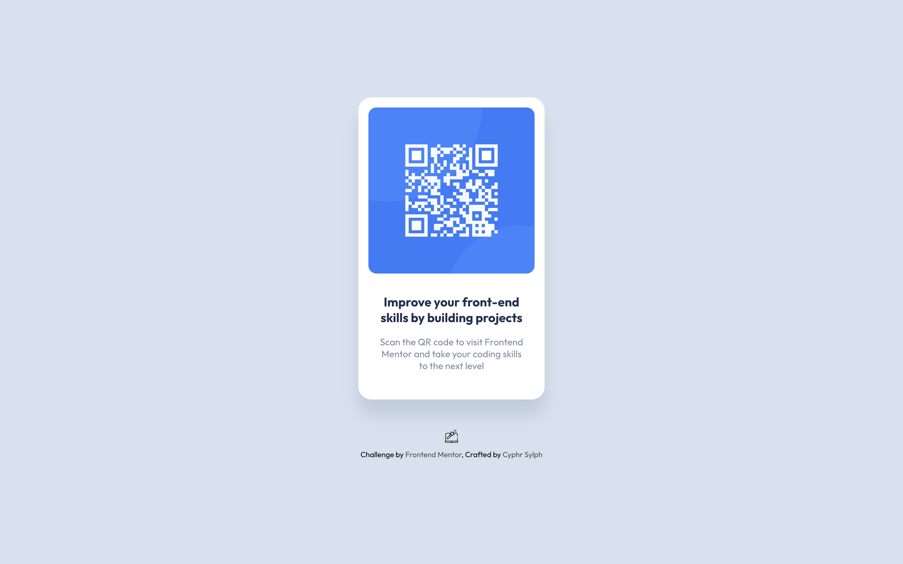

## QR Code Component
- Static card component featuring a QR code
- Built with [React](https://beta.reactjs.org/) and pure CSS
- Deployed via [Firebase](firebase.google.com)
- Challenge made available by [Frontend Mentor](https://www.frontendmentor.io/challenges/qr-code-component-iux_sIO_H)
